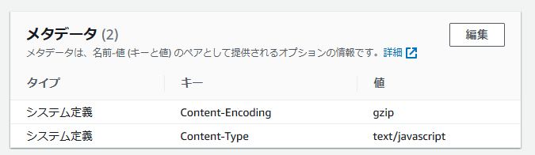

# react-terraform-deploy1

## 概要

AWS S3はS3オブジェクト各々に「メタデータ」を付加できます。


gzip圧縮したデータをS3に置いて、
そのメタデータにHTTPレスポンスヘッダである
[Content-Encoding](https://developer.mozilla.org/ja/docs/Web/HTTP/Headers/Content-Encoding)
を追加してやると、S3をWWWアクセスした際に圧縮データが転送され、ブラウザ側では Content-Encoding ヘッダを見て透過的に解凍します。

この手法を使うと S3上の容量削減、転送の高速化が期待できます。
特に JavaScript や CSS が巨大なサイズになる
[SPA](https://ja.wikipedia.org/wiki/%E3%82%B7%E3%83%B3%E3%82%B0%E3%83%AB%E3%83%9A%E3%83%BC%E3%82%B8%E3%82%A2%E3%83%97%E3%83%AA%E3%82%B1%E3%83%BC%E3%82%B7%E3%83%A7%E3%83%B3)
では体感できるくらい高速化します。

なお、S3直ではなく
AWS CloudFrontを使っている場合は、
動的に圧縮できますので試してみてください。  
参照: [圧縮ファイルの供給 - Amazon CloudFront](https://docs.aws.amazon.com/ja_jp/AmazonCloudFront/latest/DeveloperGuide/ServingCompressedFiles.html)


## サンプルコード

このプロジェクトでは
Vite で作った React のアプリを
AWS S3に
Terraformでデプロイしてみます。

今回は
.js, .json, .css, .svg を gzip 圧縮して
S3 に置いてみます。

アプリは
```bash
npm create vite@latest deploy1 -- --template react-ts
```
で作ったそのままの「ボタンを押すとカウントアップする」やつです。

`package.json` の scripts のところと、
`vite.config/ts` だけ少し修正しました。

圧縮・デプロイするコードは `deploy/`ディレクトリ以下に全部あります。


## いるもの

- [Node.js](https://nodejs.org/) (v18.12.1 使用)
- [npm](https://www.npmjs.com/package/npm) (v8.19.3 使用)
- [Terraform](https://www.terraform.io/) (v1.3.6 使用)
- AWSアカウント


## AWSのS3にデプロイ

プロジェクトルートで、最初に1回
```bash
npm i
npm run tfrm
npm run tfinit
```
を実行しておきます。

次に、もしAWSリージョンなどを変更したい場合は
`./deploy/terraform.tfvars`
を修正してください。

その後
```bash
npm run deploy
```

を実行するとランダムな名前のS3バケットを作って、コンテンツを流し込みます。

最後に
```
objecturl = "https://deploy1-xxxxxxxxxxxxxxxx-www.s3.ap-northeast-1.amazonaws.com/index.html"
s3wwwurl = "http://deploy1-xxxxxxxxxxxxxxxx-www.s3-website-ap-northeast-1.amazonaws.com/"
```
のようなのが表示されるので、
このURLをブラウザで開いてください
(上がhttps: 下がhttp:)。


テストが終わったら
```bash
npm run destroy
```
でAWSから削除してください。


## 補足: Vite

このプロジェクトは普通の
[Vite](https://vitejs.dev/)
プロジェクトなので

```bash
npm i
npm run dev
```
で開発、

```bash
npm i
npm run build
npm run preview
```
でビルド & プレビューできます。お試しあれ。

## 補足: 他のHTTPレスポンスヘッダ

このプロジェクトでは Content-Encoding ヘッダ以外に以下の
メタデータを追加しています。

### Content-Type

拡張子から Content-Type を推測して設定しています。

参考: [Content-Type - HTTP | MDN](https://developer.mozilla.org/ja/docs/Web/HTTP/Headers/Content-Type)


## 補足: Accept-Encoding

どうもS3は
[Accept-Encoding](https://developer.mozilla.org/ja/docs/Web/HTTP/Headers/Accept-Encoding)
リクエストヘッダを全然見てないようで、ネゴシエーションすることなく、常に圧縮データを送ってきます。なんらかの理由で自前のhttpクライアントを使う場合には気をつけましょう。

(curl には compressed オプションがあります。
参照: [Compression - Everything curl](https://everything.curl.dev/usingcurl/downloads/compression))


## TODO

[Brotli](https://ja.wikipedia.org/wiki/Brotli)圧縮も試す (https:のみ)。
